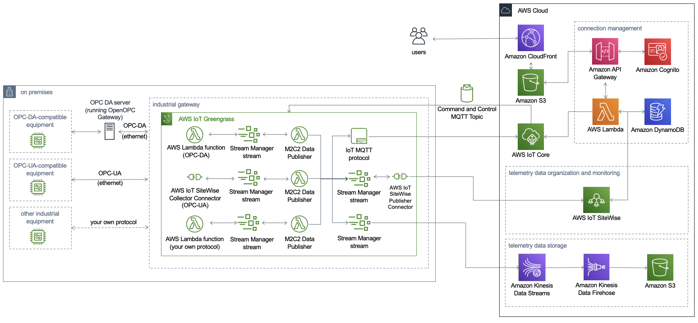

**[Machine to Cloud Connectivity Framework](https://aws.amazon.com/solutions/implementations/machine-to-cloud-connectivity-framework/)** | **[🚧 Feature request](https://github.com/awslabs/machine-to-cloud-connectivity-framework/issues/new?assignees=&labels=enhancement&template=feature_request.md&title=)** | **[🐛 Bug Report](https://github.com/awslabs/machine-to-cloud-connectivity-framework/issues/new?assignees=&labels=bug&template=bug_report.md&title=)** | **[❓ General Question](https://github.com/awslabs/machine-to-cloud-connectivity-framework/issues/new?assignees=&labels=question&template=general_question.md&title=)**

**Note**: If you want to use the solution without building from source, navigate to Solution Landing Page.

## Table of Content
- [Solution Overview](#solution-overview)
- [Architecture Diagram](#architecture-diagram)
- [AWS CDK and Solutions Constructs](#aws-cdk-and-solutions-constructs)
- [Customizing the Solution](#customizing-the-solution)
  - [Prerequisites for Customization](#prerequisites-for-customization)
  - [Unit Test](#unit-test)
  - [Build](#build)
  - [Deploy](#deploy)
- [License](#license)

# Solution Overview
The Machine to Cloud Connectivity Framework solution helps factory production managers connect their operational technology assets to the cloud, providing robust data ingestion from on-premises machines into AWS. This solution allows for seamless connection to factory machines using either the OPC Data Access (OPC DA) protocol or the OPC Unified Architecture (OPC UA) protocol.

This solution automatically deploys AWS IoT Greengrass and provides integration with AWS IoT SiteWise, so you can ingest OPC DA and OPC UA telemetry data into AWS IoT SiteWise. This solution also provides the capability to store telemetry data in an Amazon Simple Storage Service (Amazon S3) bucket, thereby allowing for analysis of factory machine data for insights and advanced analytics.

This solution is a framework for connecting factory equipment, allowing you to focus on extending the solution's functionality rather than managing the underlying infrastructure operations. For example, you can push the equipment data to Amazon S3 using Amazon Kinesis Data Streams and Amazon Kinesis Data Firehose and run machine learning models on the data for predictive maintenance, or create notifications and alerts.

For more information and a detailed deployment guide, visit the [Machine to Cloud Connectivity Framework](https://aws.amazon.com/solutions/implementations/machine-to-cloud-connectivity-framework/) solution page.

# Architecture Diagram


# AWS CDK and Solutions Constructs
[AWS Cloud Development Kit (AWS CDK)](https://aws.amazon.com/cdk/) and [AWS Solutions Constructs](https://aws.amazon.com/solutions/constructs/) make it easier to consistently create well-architected infrastructure applications. All AWS Solutions Constructs are reviewed by AWS and use best practices established by the AWS Well-Architected Framework. This solution uses the following AWS Solutions Constructs:
- [aws-cloudfront-s3](https://docs.aws.amazon.com/solutions/latest/constructs/aws-cloudfront-s3.html)
- [aws-kinesisstreams-kinesisfirehose-s3](https://docs.aws.amazon.com/solutions/latest/constructs/aws-kinesisstreams-kinesisfirehose-s3.html)
- [aws-lambda-dynamodb](https://docs.aws.amazon.com/solutions/latest/constructs/aws-lambda-dynamodb.html)
- [aws-sqs-lambda](https://docs.aws.amazon.com/solutions/latest/constructs/aws-sqs-lambda.html)

In addition to the AWS Solutions Constructs, the solution uses AWS CDK directly to create infrastructure resources.
# Customizing the Solution
## Prerequisites for Customization
- [AWS Command Line Interface](https://aws.amazon.com/cli/)
- Node.js 14.x or later
- Python 3.7 or later

### 1. Clone the repository
```bash
git clone https://github.com/awslabs/machine-to-cloud-connectivity-framework.git
cd machine-to-cloud-connectivity-framework
export MAIN_DIRECTORY=$PWD
```

### 2. Declare environment variables
```bash
export REGION=aws-region-code # the AWS region to launch the solution (e.g. us-east-1)
export DIST_OUTPUT_BUCKET=my-bucket-name # bucket where customized code will reside, randomized name recommended
export SOLUTION_NAME=my-solution-name # the solution name
export VERSION=my-version # version number for the customized code
```

## Unit Test
After making changes, run unit tests to make sure added customization passes the tests:
```bash
cd $MAIN_DIRECTORY/deployment
chmod +x run-unit-tests.sh
./run-unit-tests.sh
```

## Build
```bash
cd $MAIN_DIRECTORY/deployment
chmod +x build-s3-dist.sh
./build-s3-dist.sh $DIST_OUTPUT_BUCKET $SOLUTION_NAME $VERSION
```

## Deploy
### 1. Create an Amazon Simple Storage Service (Amazon S3) bucket
To deploy the customized solution, create a regional Amazon S3 bucket so that AWS Lambda functions can get the source code zip files from the regional bucket.
```bash
aws s3 md s3://$DIST_OUTPUT_BUCKET-$REGION --region $REGION
```

### 2. Upload the assets to the bucket
```bash
cd $MAIN_DIRECTORY/deployment
aws s3 sync ./regional-s3-assets/ s3://$DIST_OUTPUT_BUCKET-$REGION/$SOLUTION_NAME/$VERSION/ --acl bucket-owner-full-control
aws s3 sync ./global-s3-assets/ s3://$DIST_OUTPUT_BUCKET-$REGION/$SOLUTION_NAME/$VERSION/ --acl bucket-owner-full-control
```
### 3. Deploy the solution
- Get the link of the `machine-to-cloud-connectivity.template` uploaded to your Amazon S3 bucket.
- Deploy the Machine to Cloud Connectivity Framework solution to your account by launching a new AWS CloudFormation stack using the S3 link of the `machine-to-cloud-connectivity.template`.

# Collection of operational metrics
This solution collects anonymous operational metrics to help AWS improve the quality and features of the solution. For more information, including how to disable this capability, please see the [implementation guide](https://docs.aws.amazon.com/solutions/latest/machine-to-cloud-connectivity-framework/operational-metrics.html).

# License
Copyright 2019-2021 Amazon.com, Inc. or its affiliates. All Rights Reserved.

SPDX-License-Identifier: Apache-2.0