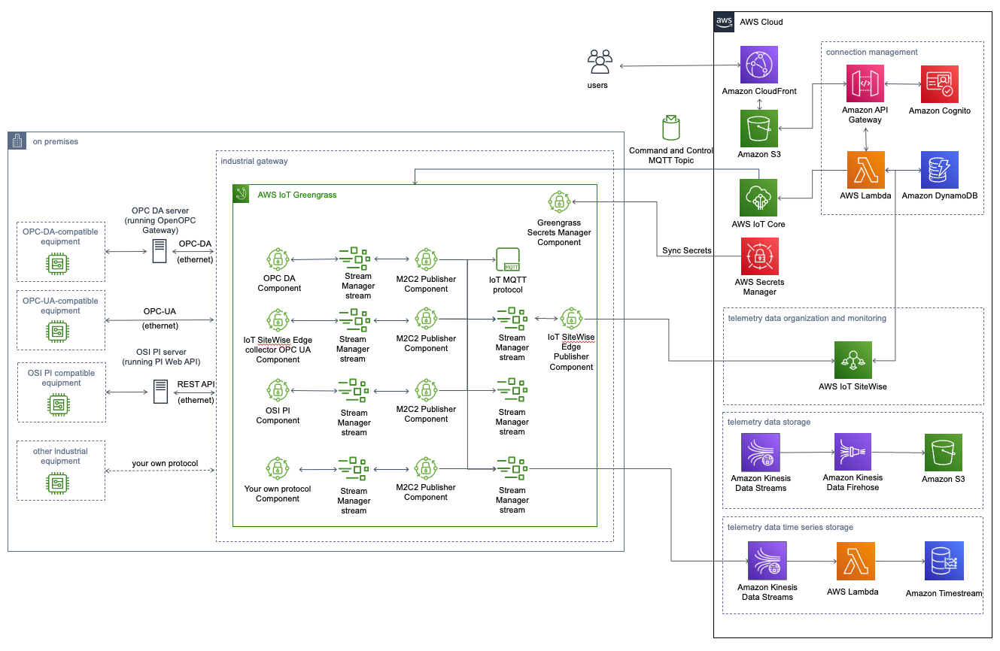

**[Machine to Cloud Connectivity Framework](https://aws.amazon.com/solutions/implementations/machine-to-cloud-connectivity-framework/)** | **[🚧 Feature request](https://github.com/aws-solutions/machine-to-cloud-connectivity-framework/issues/new?assignees=&labels=enhancement&template=feature_request.md&title=)** | **[🐛 Bug Report](https://github.com/aws-solutions/machine-to-cloud-connectivity-framework/issues/new?assignees=&labels=bug&template=bug_report.md&title=)** | **[❓ General Question](https://github.com/aws-solutions/machine-to-cloud-connectivity-framework/issues/new?assignees=&labels=question&template=general_question.md&title=)**

**Note**: If you want to use the solution without building from source, navigate to Solution Landing Page.

## Table of Content

- [Solution Overview](#solution-overview)
- [Architecture Diagram](#architecture-diagram)
- [AWS CDK and Solutions Constructs](#aws-cdk-and-solutions-constructs)
- [Customizing the Solution](#customizing-the-solution)
  - [Prerequisites for Customization](#prerequisites-for-customization)
    - [1. Clone the repository](#1-clone-the-repository)
    - [2. Declare environment variables](#2-declare-environment-variables)
  - [Unit Test](#unit-test)
  - [Build](#build)
  - [Deploy](#deploy)
- [Collection of operational metrics](#collection-of-operational-metrics)
- [License](#license)
- [NOTES](#notes)

# Solution Overview

The Machine to Cloud Connectivity Framework solution helps factory production managers connect their operational technology assets to the cloud, providing robust data ingestion from on-premises machines into the AWS cloud. This solution allows for seamless connection to factory machines using either the OPC Data Access (OPC DA) protocol or the OPC Unified Architecture (OPC UA) protocol.

This solution provides an ability to deploy AWS IoT Greengrass core devices to industrial gateways and integration with AWS IoT SiteWise, so you can ingest OPC DA and OPC UA telemetry data into AWS IoT SiteWise. This solution also provides the capability to store telemetry data in an Amazon Simple Storage Service (Amazon S3) bucket, AWS IoT MQTT topic, and Amazon Timestream, thereby allowing for analysis of factory machine data for insights and advanced analytics.

This solution is a framework for connecting factory equipment, allowing you to focus on extending the solution's functionality rather than managing the underlying infrastructure operations. For example, you can push the equipment data to Amazon S3 using Amazon Kinesis Data Streams and Amazon Kinesis Data Firehose and run machine learning models on the data for predictive maintenance, or create notifications and alerts.

For more information and a detailed deployment guide, visit the [Machine to Cloud Connectivity Framework](https://aws.amazon.com/solutions/implementations/machine-to-cloud-connectivity-framework/) solution page.

# Architecture Diagram



# AWS CDK and Solutions Constructs

[AWS Cloud Development Kit (AWS CDK)](https://aws.amazon.com/cdk/) and [AWS Solutions Constructs](https://aws.amazon.com/solutions/constructs/) make it easier to consistently create well-architected infrastructure applications. All AWS Solutions Constructs are reviewed by AWS and use best practices established by the AWS Well-Architected Framework. This solution uses the following AWS Solutions Constructs:

- [aws-cloudfront-s3](https://docs.aws.amazon.com/solutions/latest/constructs/aws-cloudfront-s3.html)
- [aws-iot-sqs](https://docs.aws.amazon.com/solutions/latest/constructs/aws-iot-sqs.html)
- [aws-kinesisstreams-kinesisfirehose-s3](https://docs.aws.amazon.com/solutions/latest/constructs/aws-kinesisstreams-kinesisfirehose-s3.html)
- [aws-kinesisstreams-lambda](https://docs.aws.amazon.com/solutions/latest/constructs/aws-kinesisstreams-lambda.html)
- [aws-lambda-dynamodb](https://docs.aws.amazon.com/solutions/latest/constructs/aws-lambda-dynamodb.html)
- [aws-sqs-lambda](https://docs.aws.amazon.com/solutions/latest/constructs/aws-sqs-lambda.html)

In addition to the AWS Solutions Constructs, the solution uses AWS CDK directly to create infrastructure resources.

# Customizing the Solution

## Prerequisites for Customization

- [Node.js](https://nodejs.org/en/) 16.x or later
- [Python](https://www.python.org/) 3.8 or later
- [Yarn](https://yarnpkg.com/)

### 1. Clone the repository

```bash
git clone https://github.com/aws-solutions/machine-to-cloud-connectivity-framework.git
cd machine-to-cloud-connectivity-framework
export MAIN_DIRECTORY=$PWD
```

### 2. Declare environment variables

```bash
export DIST_BUCKET_PREFIX=my-bucket-prefix # S3 bucket name prefix
export SOLUTION_NAME=my-solution-name
export VERSION=my-version # version number for the customized code
export REGION=aws-region-code # the AWS region to test the solution (e.g. us-east-1)
```

_Note:_ When you define `DIST_BUCKET_PREFIX`, a randomized value is recommended. You will need to create an S3 bucket where the name is `<DIST_BUCKET_PREFIX>-<REGION>`. The solution's CloudFormation template will expect the source code to be located in a bucket matching that name.

## Unit Test

After making changes, run unit tests to make sure added customization passes the tests:

```bash
cd $MAIN_DIRECTORY/deployment
chmod +x run-unit-tests.sh
./run-unit-tests.sh
```

## Build

```bash
cd $MAIN_DIRECTORY/deployment
chmod +x build-s3-dist.sh
./build-s3-dist.sh $DIST_BUCKET_PREFIX $SOLUTION_NAME $VERSION $SHOULD_SEND_ANONYMOUS_USAGE $SHOULD_TEARDOWN_DATA_ON_DESTROY
```

To consent to sending anonymous usage metrics, use "Yes" for $SHOULD_SEND_ANONYMOUS_USAGE
To have s3 buckets, timestream database torn down, use "Yes" for $SHOULD_TEARDOWN_DATA_ON_DESTROY

## Deploy

- Deploy the distributable to the Amazon S3 bucket in your account. Make sure you are uploading all files and directories under `deployment/global-s3-assets` and `deployment/regional-s3-assets` to `<SOLUTION_NAME>/<VERSION>` folder in the `<DIST_BUCKET_PREFIX>-<REGION>` bucket (e.g. `s3://<DIST_BUCKET_PREFIX>-<REGION>/<SOLUTION_NAME>/<VERSION>/`).
- Get the link of the solution template uploaded to your Amazon S3 bucket.
- Deploy the solution to your account by launching a new AWS CloudFormation stack using the link of the solution template in Amazon S3.

CLI based CloudFormation deployment:

```bash

export INITIAL_USER=name@example.com

aws cloudformation create-stack \
   --profile ${AWS_PROFILE:-default} \
   --region ${REGION} \
   --template-url https://${DIST_BUCKET_PREFIX}-${REGION}.s3.amazonaws.com/${SOLUTION_NAME}/${VERSION}/machine-to-cloud-connectivity-framework.template \
   --stack-name m2c2 \
   --capabilities CAPABILITY_IAM CAPABILITY_NAMED_IAM CAPABILITY_AUTO_EXPAND \
   --parameters \
        ParameterKey=UserEmail,ParameterValue=$INITIAL_USER \
        ParameterKey=LoggingLevel,ParameterValue=ERROR \
        ParameterKey=ExistingKinesisStreamName,ParameterValue="" \
        ParameterKey=ExistingTimestreamDatabaseName,ParameterValue="" \
        ParameterKey=ShouldRetainBuckets,ParameterValue=True

```

# Collection of operational metrics

This solution collects anonymous operational metrics to help AWS improve the quality and features of the solution. For more information, including how to disable this capability, please see the [implementation guide](https://docs.aws.amazon.com/solutions/latest/machine-to-cloud-connectivity-framework/operational-metrics.html).

# License

Copyright Amazon.com, Inc. or its affiliates. All Rights Reserved.

SPDX-License-Identifier: Apache-2.0


# NOTES

On some operating systems, Python virtual environment must be installed manually
```bash
sudo apt install python3.8-venv
```

For the OSI PI connector, the following must be installed prior to deployment of M2C2 on the IoT Core Device
```bash
sudo apt-get install libkrb5-dev
```

If using Amazon linux, use the following commands instead
```bash
yum -y install krb5-devel
yum -y install gcc
yum -y install python3-devel
```